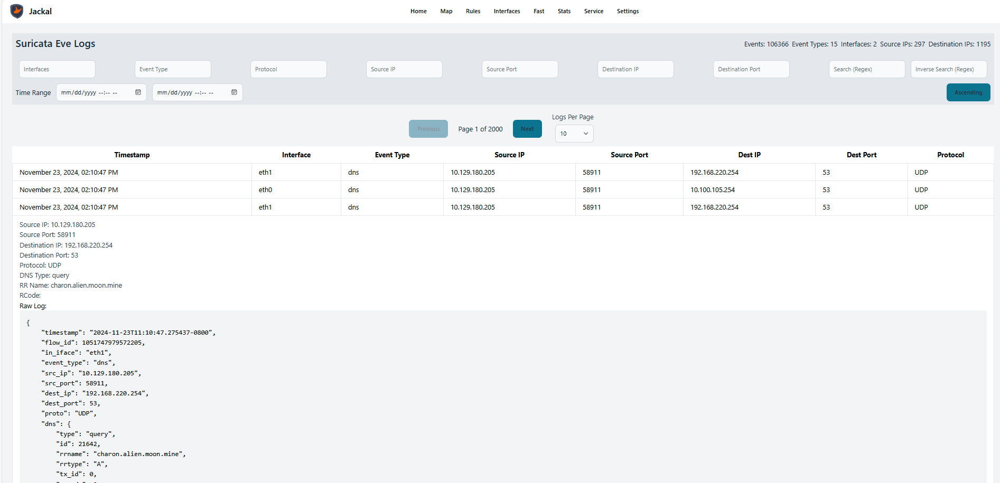

# Jackal

Jackal provides easy management of Suricata through a user-friendly web interface. Built with Node.js, it allows users to configure, monitor, and analyze network traffic efficiently. The platform offers real-time alerts, detailed logs, and customizable dashboards to enhance network security and streamline operations. Whether you are a network administrator or a security professional, Jackal simplifies the complexities of Suricata, making it accessible and effective for all users.

## Reason

Suricata is a powerful application with extensive capabilities, but it can be challenging to navigate through numerous log files. While ELK stacks, Wazuh, and Tulip are excellent tools that assist with this, they can be time-consuming to deploy and manage, especially during competitions. Jackal offers a user-friendly interface for Suricata, enabling easy setup and management. It is designed to be a straightforward yet effective interface, simplifying the complexities of Suricata. However, referring to the Suricata documentation remains essential for in-depth understanding and usage.

## Setup

Make sure to have Suricata installed on the system you want to deploy this on. Plans in the future to add more robust support.



## Install

```sh
cd server
npm i
npm run build
npm run start
```

These will be automated in future.

recommended: use the docker-compose file after changing the environment vars

## Open-source

Following in the footsteps of Suricata, all of this is free to use and managed as deemed necessary.

## TO DO

-   Implement more settings and configurations
-   Add more tests
-   Implement a way to install automatically on systems
-   Add user authentication and authorization
-   Improve documentation
-   Error Handling :0
-   Change backend to a faster lanagage (Go), and implment protobuf 
## known issues

-   when tag button doesn't show tagged log after reload
